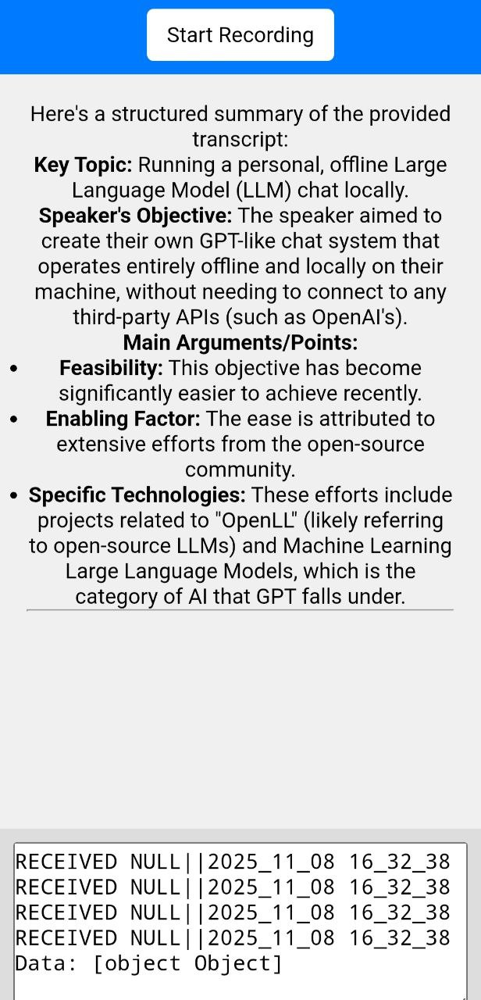

# Note taking app


Real-time lecture note-taking app powered by speech recognition and summarization.

Classnote listens to live speech, transcribes it in real time, and generates concise summaries — perfect for lectures, meetings, and brainstorming sessions.
Built with Vanilla JS, FastAPI, RabbitMQ, and OpenAI Whisper + Gemini models.

## 🚀 Features:
- 🎤 Real-time speech recognition — streams audio chunks directly from the browser.
- 🌍 Multilingual support — powered by Whisper for accurate global transcription.
- 🧠 Automatic summarization — GPT-generated summaries in bullet or paragraph format.
- ⚡ Lightweight architecture — minimal setup, low latency, and dockerized deployment.
- 🔧 Extensible — plug in your own transcription or summarization engines later.

## Flow:
- The client captures microphone input and sends small audio chunks (.wav) to the server.
- FastAPI receives and queues them using RabbitMQ.
- A background Whisper worker handles transcription locally.
- Transcripts are summarized by a GPT model (custom options supported).
- Results stream back to the browser interface.

## 🧩 Tech Stack
| Layer             | Technology                                |
| ----------------- | ----------------------------------------- |
| Frontend          | Vanilla JavaScript (Web Audio API, Fetch) |
| Backend           | FastAPI (Python)                          |
| Queue / Messaging | RabbitMQ                                  |
| Speech Model      | Local OpenAI Whisper                      |
| Summarization     | GPT (Customizable)                        |
| Deployment        | Docker Compose                            |

## 🧰 Getting Started
Prerequisites:
- Docker & Docker Compose installed
- Microphone access enabled in browser
- CUDA Container Toolkit installed for GPU support. Ensure your NVIDIA drivers are compatible and follow NVIDIA’s official guide for the Container Toolkit.

**FOR NOW PROPER DOCKER SUPPORT IS UNDER DEVELOPMENT**
**YOU CAN START RABBITMQ SERVER, FASTAPI AND THE WORKER LOCALLY**
```sh
sudo docker-compose up rabbitmq
uv run uvicorn app.main:app & uv run -m worker.worker
```

## 🖼️ Screenshots
